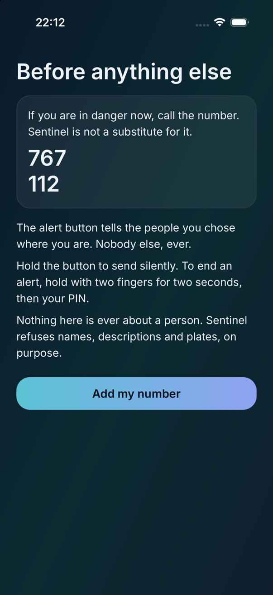
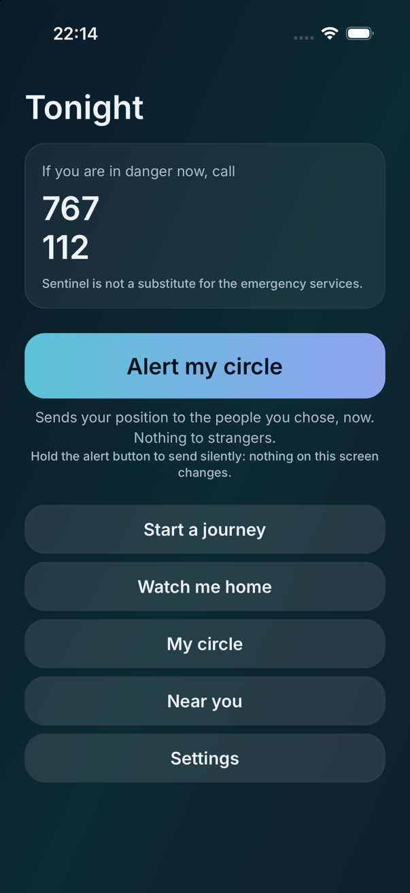
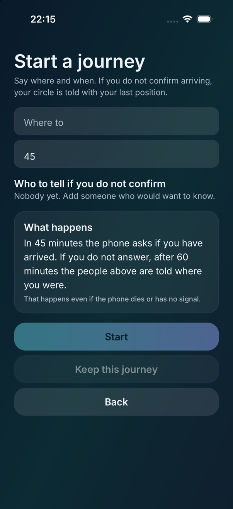
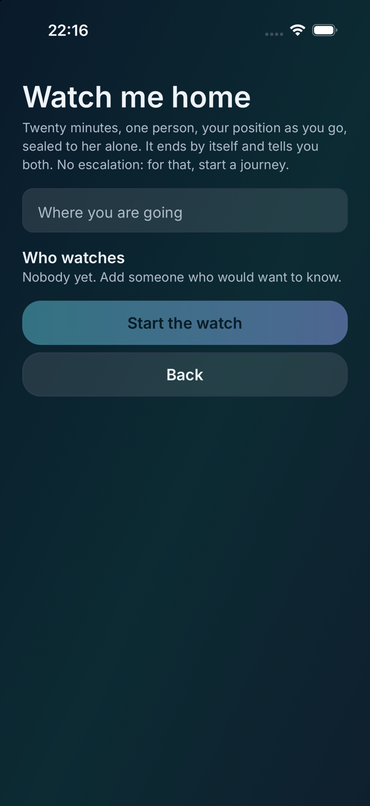
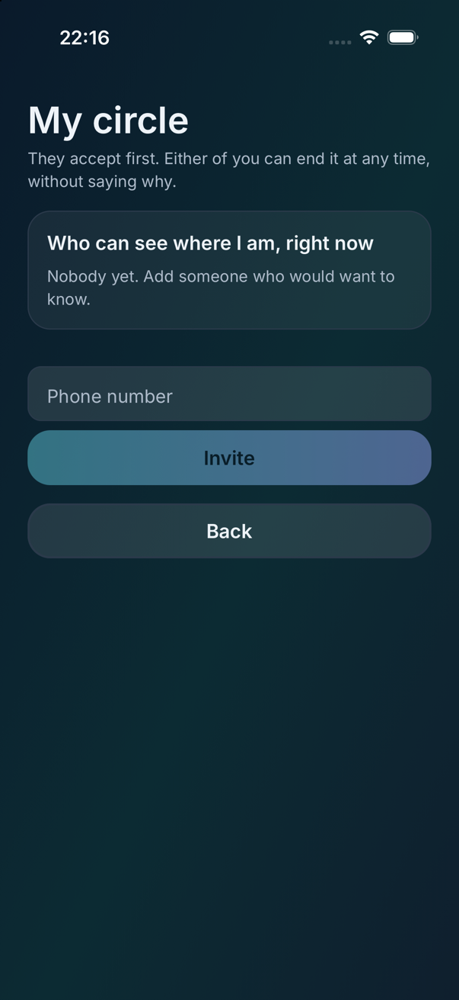
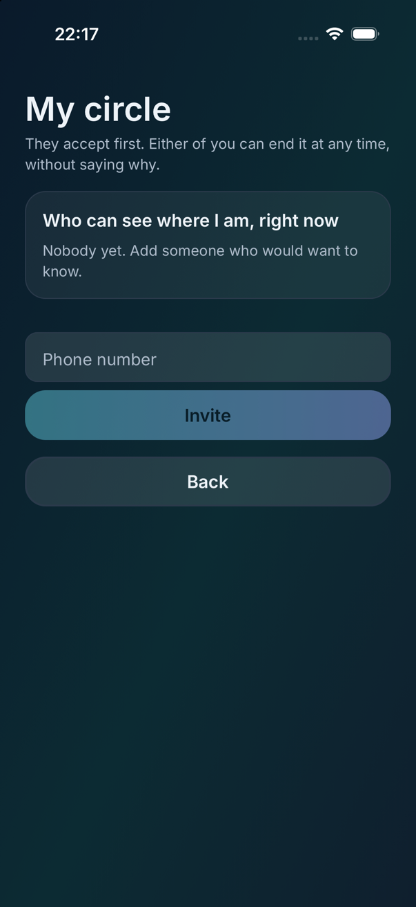
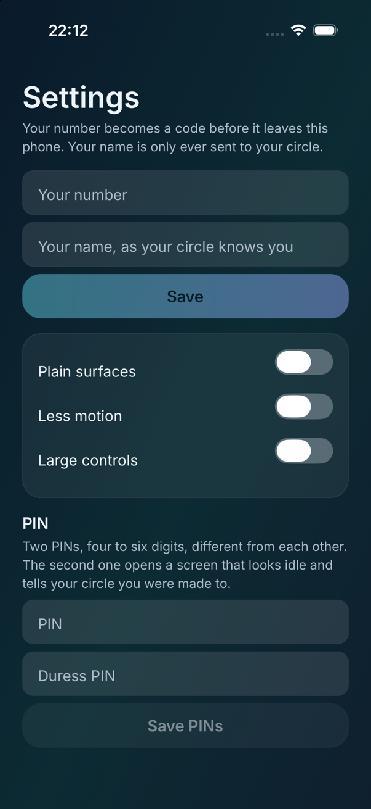
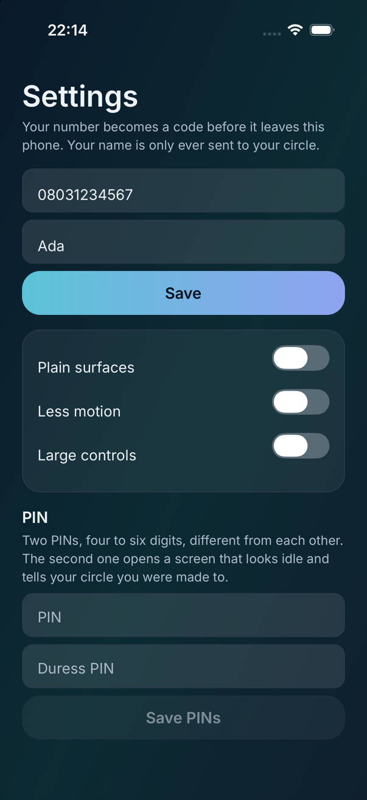
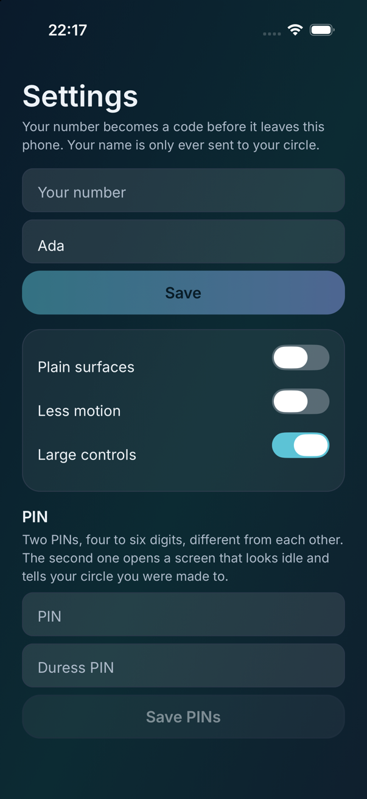

# Sentinel

Community safety coordination and emergency alerting for Nigeria.

Sentinel puts a panic action under your thumb that reaches your own circle in
under two seconds — by push, by SMS when there is no data, and by Bluetooth
relay when there is no service — and a safe-arrival check-in that tells your
circle where you were if you do not confirm arriving, even when the phone is
dead. In a later release, behind its own gates, it adds a community incident
feed built on one inversion: **reach is earned, not granted.**

> **Read this first.** Sentinel is the only product in this portfolio where a
> design error causes direct physical harm. A false alarm can start a mob. A
> "suspicious person" report can get somebody killed. A rumour carried by a
> well-built app travels faster than one on WhatsApp. Every decision in this
> repository is constrained by that fact, and the abuse model was written
> before any feature — see [`docs/00-PRODUCT-STATEMENT.md`](docs/00-PRODUCT-STATEMENT.md)
> and the fourteen ADRs in [`docs/adr/`](docs/adr/).

---

## 1. The problem

Emergency response in most of Nigeria is not slow. It is absent. There is no
number that reliably summons help in a useful time, and in many places the
nearest effective responder is not a service at all but a neighbour, an estate
gate, or a community-sanctioned group. So people improvise, and the
improvisation is a WhatsApp group.

The WhatsApp group fails in four specific ways. Nobody is watching it at 2am.
It has no geography — it reaches whoever joined, not whoever is near. It
amplifies rumour and has no way to correct it. And it has caused deaths:
unverified accusations of theft, kidnapping or witchcraft, circulated in local
groups, have led directly to mob violence. That is not a hypothetical risk of
the category. It is the category's documented history, and any product that
enters it inherits that failure as its primary design problem.

The insight the whole product rests on:

> **In a system where a false alarm can kill someone, distribution must be
> earned, not granted.**

Every social product optimises for reach. Applied here, that produces a faster
lynching. Sentinel inverts it. Posting is easy; **reach is metered**. A report
is visible to a few hundred metres and widens only with independent
corroboration, reporter history and time. A single account — however
panicked, however malicious — cannot alarm a city.

The personal alert is different, and deliberately so: fast, unmetered and
unconditional, because it goes to people who already know and trust you. The
asymmetry is the design.

> **Alerting your own circle is a right. Alarming strangers is a privilege.**

### What it is not

**Sentinel never reports a person.** No names, no photographs of people, no
descriptions, no plates. Incidents are events at places. There is no
*suspicious person* category, and there will never be one; the category list
is closed, free text is screened for anything that would make it about a
person, and the screen fails closed. This one rule removes the mechanism by
which safety apps get people killed ([ADR-0003](docs/adr/0003-nothing-about-a-person.md)).

**Sentinel does not coordinate a response.** No muster points, no "who is
nearby and available", no dispatch, no map of responders. The circle screen
during an alert shows who has *acknowledged*, never where they are, because a
map of who is coming is a muster with a friendlier name.

**Sentinel does not broadcast to strangers by default.** A personal alert
reaches your circle and the organisations you explicitly opted into. Wider
distribution needs verification thresholds a single account cannot reach.

**Sentinel is not a substitute for the emergency services.** It says so in the
app, and the official numbers are on every alert surface, larger than
Sentinel's own actions.

**Sentinel has no engagement.** No counts, no badges, no ranking, no
notifications about anything outside the radius you chose, and no analytics
SDK installed at all. A safety app optimised for engagement is a machine for
manufacturing fear ([ADR-0005](docs/adr/0005-calm-over-a-night-mesh.md)).

**Sentinel's server cannot read a location.** An alert's position leaves the
phone sealed to the circle's keys; the server relays envelopes, runs timers
and meters reach. It never opens one, and a test proves it cannot
([ADR-0004](docs/adr/0004-the-server-is-dotnet-and-holds-only-what-it-cannot-read.md)).

---

## 2. How it works

### Two paths that share nothing

The personal path and the public path are separate modules, separate
endpoints, separate screens and separate release gates, with nothing in common
but the design system and the crypto. A test asserts that neither half of the
domain imports the other. The personal path ships alone as v1.0; the public
path is a later release that can be withdrawn without touching it
([ADR-0007](docs/adr/0007-alerting-your-circle-is-a-right-and-alarming-strangers-is-a-privilege.md)).

### The personal path

**The circle.** You add people by phone number; they accept before anything is
shared; either side ends it at any moment without giving a reason. A member
receives your location only during an alert or a journey you shared with them,
and one screen — *who can see where I am, right now* — is always current.

**The alert.** A trigger on every path the platform offers — lock-screen
widget, quick tile, power-button gesture, the Action Button, Back Tap — sends a
pre-computed payload before the app is awake, by push, by server SMS, by device
SMS on Android, and by Bluetooth relay through nearby Sentinel phones that
learn an alert exists and nothing in it. The screen shows the official numbers
first, then the honest delivery state: *your circle has been told*, *reaching
your circle*, or *your circle could not be reached — call the number above*.
Cancelling takes a two-finger hold and your PIN, which is a thing a coercer
cannot do by reaching over; the duress PIN cancels on the screen and tells the
circle *under duress* silently ([ADR-0008](docs/adr/0008-coercion-is-a-use-case.md)).

**Safe arrival — the wedge.** A journey takes under twenty seconds: where, by
when, who to tell. At the expected minute the phone asks; at +5 and +10 it
asks again; at +15 the circle is told with your last position and the trail.
The plan is scheduled on the device so it fires with the app killed, and
**registered on the server so it fires with the phone dead** — the server's
copy holds the expected minute and whom to tell, never the destination.
Arrival by geofence still asks *are you there?*; automatic detection never
cancels an escalation silently. It works for one person with zero other users,
carries no abuse risk, and builds the habit of a configured circle before the
night it is needed. Nobody installs an emergency app during an emergency.

### The public path, built and held back

The code is built — the feed, the report, corroborate and dispute, the
withdrawal that reaches everyone shown — and it ships in v1.1 behind three
gates and a month in one city, not before. What follows is what the code
does.

**The closed list.** `robbery`, `burglary`, `road_blocked`, `accident`,
`fire`, `flooding`, `gunfire_heard`, `unrest_or_protest`, `building_collapse`,
`power_line_down`. No person category, no free category. The one exception,
`missing_person_appeal`, is for a verified organisation or verified next of kin
and never distributes without a human's review.

**Reach.** A pure function of the evidence, computed on the server with
authority:

| Stage | Needs | Travels | Push |
| --- | --- | --- | --- |
| `reported` | one established account | 500 m | never |
| `corroborated` | two more, independent, within 1 km and 30 min | 2 km | never |
| `confirmed` | four more independent, or one verified organisation | 5 km | opt-in |
| `verified` | an organisation and four, or an official source | area | yes |

*Independent* means sharing no device, no install lineage, no circle
relationship, and no implausibly correlated location trace, and a set of
accounts sharing any signal — directly or by chain — collapses to one for
counting. A surge in an area pins everything to `reported` pending a person. A
dispute ratio pulls a stage down. **No sequence of actions by one account, or
by any set that collapses to one, advances a report beyond `reported`** — and
the property test that says so generates 800 worlds of accounts, signals,
reports and corroborations and is a release blocker
([ADR-0002](docs/adr/0002-reach-is-earned-and-a-single-account-never-passes-500-metres.md)).

**The screen.** Free text is checked before submission for names, ethnic and
religious identifiers, descriptions of persons, clothing, plates and phone
numbers; a match blocks with the reason and an offer to describe the event
instead. Images are refused if a face is found. With the screener unavailable,
free text and images are refused and a category-and-location report still
succeeds: the screen fails closed.

**Corrections.** Every account that saw a report is remembered against it, so
a downgrade or retraction reaches exactly that audience and can never reach
fewer people than the claim did.

**On the server.** `/reports` refuses a category off the list, a fourth
report in a day, a second in half an hour, and free text the screen blocks —
with the reasons — and it holds `missing_person_appeal` to organisations.
`/organisations` and `/review` take an administrator's token: a named
reviewer decides the one category about a person, and it is not distributed
before. `/reports/nearby` computes every unexpired report's stage from what the
server knows *now* and returns only those whose reach covers the caller,
remembering each one shown. The location trace is a history, not a point:
two strangers corroborating one event from one place are neighbours, and
only five shared cells make two accounts one. Six tests on the running
server: one account's report stops at 500 m; two accounts on one device
cannot widen it and two independent ones can; a name is refused with the
reason and the category still stands; a withdrawal names everyone shown; a
new account's report reaches nobody; accounts that always move together
become one.

### The design

Glass over a night mesh — a blue-to-teal wash, never a warm one — in three
depths that each mean one thing, with a solid twin for every surface and a
zero twin for every duration, chosen at act time by two Settings toggles and
the platform's Reduce Motion. One gradient control per screen; on the alert
screen it is the panic action, 64 dp, the largest thing on the screen and under
the thumb. **There is no red**: the design gate fails on a red token. Nothing
counts, nothing pulses. Every text tone on every fill over every wash is
contrast-asserted in CI — 146 pairs — in both palettes. The floor is a
four-year-old Android phone with 2 GB, held in one hand, at night, possibly by
someone frightened ([`DESIGN.md`](DESIGN.md)).

---

## 3. The app

Phase 0 is the shell: the home, which is the alert screen because nobody opens
a panic app to browse, and the alert in progress. The trigger paths, the
channels and the keys arrive with Phases 1 and 2; the record they write is
already the domain's.

**The home.** The official numbers for your state, first and largest, and the
sentence that Sentinel is not a substitute for them. Below, the one gradient
control — *Alert my circle* — and beneath it the journey and the circle.

**The alert.** The number again at the top. The delivery state in the
palette's own words: green *told*, plain *reaching*, amber *could not be
reached* with the instruction to call. Each circle member with *acknowledged*
or *not yet* beside them, and nothing about where they are. At the bottom, the
cancel, and the sentence that says how it is done.

### The first simulator run

| Before anything else | Tonight | Start a journey |
|---|---|---|
|  |  |  |

| Watch me home | My circle | Near you, with no fix |
|---|---|---|
|  |  |  |

| Settings | Settings, filled in | Large controls |
|---|---|---|
|  |  |  |

**What the run found.** Three defects that no test could have.

The app **did not start at all**: `crypto.getRandomValues` does not exist in
Hermes and every device key begins there
([ADR-0014](docs/adr/0014-randomness-comes-from-the-platform-or-the-app-does-not-start.md)).

Every glass surface **rendered as a solid block of accent**, because the six
`glass*` tokens were written `#AARRGGBB` and React Native reads `#RRGGBBAA` —
so each text field in Settings was opaque cyan with the placeholder unreadable
on top of it. `design-check` and `contrast.test.ts` both parsed them the same
wrong way, so all three agreed on a colour that was never on the screen. All
three read `#RRGGBBAA` now, and the gate refuses the other order.

And **every gradient button stopped about 86% of the way across** while its
label stayed centred on the full width, so the primary control on each screen
read as one that had not finished drawing. The gradient is an SVG pinned with
`absoluteFill`, and it also carried `width="100%" height="100%"`; the two
fight, and react-native-svg resolved them to a box narrower than the button.

*Nothing on these screens is a record.* The number and name are typed into a
simulator; no alert has been sent, and none of the trigger paths has met a
handset with a stopwatch.

---

## 4. What each layer does

### `packages/domain` — the rules, with no platform in them

Pure TypeScript. It imports nothing from React, React Native, navigation,
storage or the platform; it takes the time and the randomness as arguments.
An ESLint rule forbids the imports, and `make boundary` injects a violation
and fails the build if the rule has stopped matching. Two halves that never
import each other:

| Module | Holds |
| --- | --- |
| `personal/circle.ts` | Invite, accept in a language, remove; *who can see me right now* and under what condition |
| `personal/journey.ts` | The plan — ask, remind, escalate — from one expected time; the state at a minute; the geofence that still asks; the server's copy without the destination |
| `personal/alert.ts` | The append-only record; the honest delivery state; acknowledgements without positions; the false-alarm mirror the user alone sees |
| `personal/duress.ts` | Which face a PIN opens; the two-finger cancel; what the circle is told |
| `personal/numbers.ts` | The official numbers, bundled, by state, never repeated |
| `personal/messages.ts` | The SMS a circle member receives, in the language she chose — English, Naijá, Yorùbá, Hausa, Igbo — with the number to call in it |
| `public/reach.ts` | Independence, the collapse, the surge, the dispute ratio, the stage |
| `public/categories.ts` | The closed list, its expiries, the per-account rate limits |
| `public/screen.ts` | The on-device screening rules and the fail-closed admission |
| `public/corrections.ts` | The audience a correction must reach |

### `packages/crypto` — the envelope, and the record's signature

X25519 agreement, HKDF, XChaCha20-Poly1305, from the audited `@noble`
packages in pure TypeScript, so the phone and Node run the same bytes with no
native module to trust. `seal` takes a position and one member's public key;
`open` takes the member's secret; the test hands a party everything the
server holds — every public key and the envelope — and it cannot open it. A
phone number becomes the circle's name for a person here too: E.164, then
SHA-256, so the server matches invitations on a hash and never holds a number.
The record's export is one JSON line per event in a fixed key order, the
phone's Ed25519 public key, and a signature over every byte before it — the
same shape Vitals' audit uses, so
[`scripts/verify-record.py`](scripts/verify-record.py) is the same hundred
lines of plain Python, and the test runs it on a good file, a flipped byte
and the wrong key. The domain knows nothing of this package.

### `apps/mobile` — the screens, and what the domain cannot own

`src/relay.ts` is the one place bytes leave the phone: it fetches each
accepted member's public key by phone hash, seals the position — or *no
position*, the same length — to each, hands the server an SMS in her language
with a link and no coordinate, and reads back the attempts the server
recorded so the record says what happened. `src/transport.ts` is the wire,
and a server in memory that a test can search for anything it should not
hold.

React Native 0.87 on the New Architecture. `src/design/tokens.ts` is
`DESIGN.md` as code and the only place a colour lives; `src/phrases.ts` is
every word the app says, so the copy gate can read them. The components are
the mesh, the glass at three depths, the two actions, and the text — each
reading the theme at act time. `src/state.ts` is the one function that
changes what the app holds — the screens dispatch to it and nothing else
touches state — so a test drives a whole evening through it without a screen:
an invitation that shares nothing until accepted, a second panic that does not
start a second record, a journey nobody confirms becoming an alert to the
people it named.

### `server` — a replica that holds only what it cannot read

ASP.NET Core 9 in C#, Postgres in production and in memory for a laptop and a
test. `Sentinel.Domain` mirrors the reach engine and the escalation plan, held
to the TypeScript by [`fixtures/reach.json`](fixtures/reach.json) — 200
generated worlds and the stage each was given, regenerated by `make fixtures`
as part of changing a rule. `Sentinel.Infrastructure` is the store: accounts as
a phone hash and a device key, circles, journeys as an escalation minute and a
list of who to tell, envelopes as nonce and ciphertext, attempts as channel,
recipient and outcome. The SMS gateway is an interface whose logging
implementation keeps that a message went and to whom, never the text.

### `apps/web` — the organisation's console

One HTML file and one module, no framework: an estate's guard house with its
own token sees the opt-ins waiting for it, the alerts sealed to it and
whether it acknowledged, and its own patrol lines — and never a position,
which is in an envelope on the phone that holds the key
([ADR-0009](docs/adr/0009-the-ladder-has-three-rungs-and-the-second-is-an-organisation-you-chose.md)).
The rules that are not arrangement are in `console.ts`, where a test holds
the shape of an alert to *when* and *whether we acknowledged*.

---

## 5. Quick start

```bash
make setup          # pnpm install
make ci             # every gate, then the domain, app and server tests
make server-run     # the replica in memory on http://localhost:5000
make app-ios        # the app on a booted simulator (needs pods: make app-pods)
```

`make test` alone runs the domain in about a second, including the 800-world
reach property. `make server-test` needs no database.

---

## 6. Correctness notes

What the gates and the tests found on the first day, kept here because each
is the kind of thing that recurs.

### A name at the start of a sentence

The first name rule required a character before the capitalised pair, so it
would not fire on a sentence's first word — and *Chukwuemeka Okafor took the
generator* walked through the screen. A name is most often at the start of a
sentence. The rule now takes any capitalised pair anywhere and excuses only a
second word that is the word for a place, so *Allen Avenue* is a road and
*Mr Adebayo* is a person.

### The exclamation mark that was TypeScript

The copy gate bans an exclamation mark, because the calm rules do. Its first
catch was `${official[0]!.label}` — the non-null assertion in a template
literal. The rule now flags a `!` that is not followed by a `.`, a word
character or a `(`.

### The green that failed on the highest glass

Dark mode's *fine* green cleared 4.5:1 on every fill but one: text on the
high glass over the teal wash, where the white alpha lifts the background
enough to lose the ratio. One of 146 pairs, found by the test and not by an
eye. The green is lighter now and `DESIGN.md` says so.

### A python that was Xcode's

Every `python3` on this Mac is a shim into Xcode, and when Xcode's licence
lapsed mid-afternoon every gate script exited 69 with a message about a
licence — and the edits made through it silently did not happen, because the
heredoc had been handed to a shell that printed a sentence and returned. Three
files were found unedited an hour later. The Command Line Tools carry their
own `python3`, `git` and `make`; the session's PATH points there until the
licence is accepted.

---

## 7. The documentation pipeline

| Document | Answers | Updated |
| --- | --- | --- |
| [`docs/JOURNAL.md`](docs/JOURNAL.md) | What did we do, and what surprised us? | Every session |
| [`CHANGELOG.md`](CHANGELOG.md) | What changed for someone using this — and, for this product, how could it be used to hurt someone and what stops it? | Every user-visible change |
| [`docs/adr/`](docs/adr/) | Why is it built this way, and what was refused? | Any non-obvious decision, before the code |
| [`docs/ROADMAP.md`](docs/ROADMAP.md) + `PHASE` | Where are we, and what finishes this phase? | When a gate goes green |
| [`docs/RELEASE-GATES.md`](docs/RELEASE-GATES.md) | What needs a phone in a hand, a person, or a city? | When a gate is cleared |
| [`DESIGN.md`](DESIGN.md) | What may a screen look like, and what may it never do? | With the tokens, held equal by a gate |

`make doc-check` fails when a document is missing, malformed, or present on
disk and not in git — the one that has actually bitten, in every project in
this portfolio — and warns when the code has moved and the journal has not.

---

## 8. Data handling

The safest dataset is the one that does not exist. The server holds only what
it cannot read, and the phone holds only what the person typed.

| Class | Examples | Rule |
| --- | --- | --- |
| Sealed to the circle | An alert's position, a journey's trail | Envelopes under keys the server never sees. A server test gives the server everything it holds and shows it cannot produce a coordinate |
| Held in plaintext, minimal | Phone-number hashes, device public keys, who is in whose circle, a journey's escalation minute and whom to tell | What the timers and the relay need, and nothing a name could be attached to |
| Sent and not kept | The SMS fallback's text | Generated at send time, sent, forgotten; the record says a message went and to whom |
| Never collected | Names, addresses, location outside an alert or a shared journey, anything about a person in a report | Not asked for; no surface accepts it; the screen refuses it |
| Coarse by design | A report's position | 500 m granularity on the public path, and the only thing that survives a report's expiry is an aggregate for route advisory |
| Attributable internally | Who reported what | Pseudonymous to other users, attributable to the operator, and stated plainly at signup — no anonymous accusation |

The data-request policy is a page in Settings (Phase 4), not a PDF on a
website.

---

## 9. Development

```bash
make ci            # everything CI runs
make gates         # the blocking checks alone: typecheck, lint, boundary, docs, copy, design, mark, counts
make test          # the domain, with the reach property
make app-test      # the app, with the 146 contrast pairs
make server-test   # the replica, with the cannot-read proof
make fixtures      # regenerate fixtures/reach.json after a rule changes
make mark          # redraw the icons and launch screens from the mark
```

Three traps worth knowing before they cost an afternoon:

- **`make fixtures` is part of changing a reach rule.** CI regenerates the
  fixture and fails on a diff, so a rule changed on one side without the other
  is a red build that names the step.
- **`export LANG=en_US.UTF-8` before any iOS build.** CocoaPods fails with
  `Encoding::CompatibilityError` and never mentions the locale.
- **pnpm hoists to the repository root.** Gradle's paths in
  `apps/mobile/android` are three levels up, not one, and the generated ones
  fail with a message about an included build that does not exist.

### Before a feature is called done

Every feature gets a written answer to *how could this be used to hurt
someone, and what stops it?* — in its changelog entry — before the checklist
in [`CLAUDE.md`](CLAUDE.md) is opened. That item is unique to this product and
it is not a formality.

---

## 10. Layout

```text
packages/domain/src/personal/   the circle, the journey, the alert, duress,
                                the numbers, the SMS in five languages — Apache-2.0
packages/domain/src/public/     reach, the closed list, the screen, corrections
packages/domain/test/           the reach property over 800 worlds; the halves
                                that never import each other; the screening corpus
packages/crypto/                the envelope and the phone hash; the server-cannot-open test
apps/mobile/src/design/         tokens (DESIGN.md as code) and the theme
apps/mobile/src/components/     the mesh, the glass, the two actions, the text
apps/mobile/src/screens/        the welcome, the home, the alert, the circle, the journey, settings, the lock,
                                the feed within reach, the report with its explainer; the watch, my places,
                                the organisation opt-in, the data-request page
apps/mobile/src/community.ts    the public path's client: the screen on the phone, then the server's
apps/mobile/src/geo.ts          degrees to the metres the reach engine is written in
apps/mobile/src/components/HoldToCancel.tsx  two fingers, two seconds; PinPad.tsx — digits hashed before anything sees them
apps/mobile/src/state.ts        the one function that changes what the app holds
apps/mobile/src/relay.ts        the one place bytes leave the phone: seal, send, read back the attempts
apps/mobile/src/keystore.ts     the device keys from the platform's store, or for this launch, and which
apps/mobile/src/native/         the SentinelSecrets spec; the Swift and Kotlin halves are under ios/ and android/
apps/mobile/src/transport.ts    the wire; and a server in memory a test can search
apps/mobile/src/phrases.ts      every word the app says
apps/web/                       the organisation's console: one module, and the rules a test holds
apps/mobile/__tests__/          the contrast pairs; the home to the alert and back;
                                the circle and the journey; an evening through the reducer
server/src/Sentinel.Domain/     reach, the escalation plan, the screen and advisory, in C#
server/src/Sentinel.Infrastructure/  the store, the SMS gateway interface, and Community — reach computed per report
server/src/Sentinel.Api/        the endpoints; Messages.cs is read by the copy gate
server/tests/                   parity over the fixture; the server cannot read
fixtures/reach.json             what the TypeScript said about 200 worlds, for the C# to agree with
fixtures/screen.json            what it said about 135 texts, for the same reason
fixtures/categories.json        the closed list and its hours
fixtures/advisory.json          120 generated cells: the hours each speaks, or its silence
scripts/                        the gates: boundary, doc, copy, design, mark, counts, fixtures;
                                verify-record.py — the export checked with nothing but Python
docs/adr/                       the thirteen decisions, and the six things refused
```

---

## 11. Status

Phase 1 of eight: crypto and the circle. The foundation is green on this
machine and in CI; the envelope, the circle screen with *who can see me* and
the journey screen with its plan shown before it starts are built on top of
it.

**24 domain tests including the 800-world reach property, 8 crypto tests
including the server-cannot-open proof and the export verified under Python,
186 app tests including 146 contrast
pairs, an evening against a server in memory and the cancel a coercer cannot
perform, 22 server tests including the cannot-read proof, reach and screen and
category and advisory parity, the 500 m ceiling on the running server, the
appeal held until a named reviewer approves it, and the organisation's console
seeing acknowledgement and nothing else; 3 console tests.**

| | |
|---|---|
| Phase | 1 of 8 |
| ADRs | 14 |
| Things beyond the plan | 30 built or scheduled, 6 refused (ADR-0006) |
| Gates | 8 blocking `make ci`; 8 needing hardware, people or a city |

| Phase | State |
| --- | --- |
| **0** Foundation | Built and green in CI; the Critical Alerts application (R5) is a form to Apple |
| **1** Crypto and the circle | **current** — the envelope, the relay that seals an alert to every accepted member, the circle screen and *who can see me*; the device keys in the Keychain on iOS and EncryptedSharedPreferences on Android, both compiled in CI, neither yet watched survive a reboot on a handset. Since 2026-09-17 a member can be an organisation the person opted into, on the ladder's second rung ([ADR-0009](docs/adr/0009-the-ladder-has-three-rungs-and-the-second-is-an-organisation-you-chose.md)) |
| **2** The panic path | The record, the honest delivery state and the server channel are built; the position, every trigger path and the other channels need a handset (R1, R2, R4) |
| **3** Safe arrival | The plan, the states, the geofence, the server's timer and the screen that shows the plan before it starts are built and tested; journey templates and safe places kept on the phone ([ADR-0010](docs/adr/0010-places-the-phone-keeps-are-never-sent.md)); *watch me home* with one watcher and positions sealed to her ([ADR-0011](docs/adr/0011-watch-me-home-is-a-journey-with-one-watcher-and-an-end-it-keeps-itself.md)); the phone-off gate (R3) needs a phone |
| **4** Trust surfaces → v1.0 | Duress, the two-finger cancel, the decoy, silent mode, the privacy card, the signed export, the onboarding that teaches the rules, the ladder drawn, the organisation's opt-in and receipt of an alert, and the data-request page ([ADR-0013](docs/adr/0013-the-data-request-policy-is-a-page-in-the-app.md)) are built; the audit on hardware and the outside reading (R7) remain |
| **5** The reach engine | **Built and property-tested**, ahead of order, because the riskiest surface should have the most tested rule behind it |
| **6** Content screening | The rules run on the phone and on the server, held to each other by a fixture of 135 texts; the model beyond the rules and the face check need a corpus and a camera |
| **7** The community layer → v1.1 | The code is built last, as planned — the feed within reach, the report with the explainer, corroborate, dispute, withdraw with its audience, the organisation console and the review queue — and held behind three gates and a month in one city (R6, R7) |
| **8** Advisory → v1.2 | The five-language SMS, advisory as a place and hours above thresholds held to the phone by a fixture, patrol logging and the organisation's web console ([ADR-0012](docs/adr/0012-advisory-is-places-and-hours-and-a-patrol-is-a-line-an-organisation-writes.md)) are built; the native speakers are the gate |

### What is open, and why it matters

| Open | Blocks | Why it is not closed |
| --- | --- | --- |
| Under two seconds from a locked device, every path, both platforms | v1.0 (R1) | A panic control that is slow is one that is not pressed. Only a stopwatch and a handset can measure it |
| The delivery matrix | v1.0 (R2) | Data/no-data × service/no-service × platform needs a SIM with no data and a room with no service |
| Escalation with the phone switched off | v1.0 (R3) | The server's timer is built and tested; the gate is a phone, off, at the expected minute |
| Mesh relay on mixed hardware | v1.0 (R4) | Three handsets, hop limits watched, nothing readable on the air |
| An outside reading of the abuse model | v1.0 (R7) | Someone who has seen the WhatsApp failure, reading every surface for a way to hurt someone |
| Thirty days in one city, zero harm | v1.1 (R6) | The community layer's only real test, and the one that governs whether it ships at all |

---

## 12. Licensing

Two licences, because the two halves have opposite jobs.

**The application and the server are under the [Business Source License 1.1](LICENSE).**
You may use them in production to alert your own circle, run safe-arrival
check-ins, and coordinate the safety of a community, estate or organisation
you belong to or serve. You may not offer Sentinel itself to third parties as
a hosted emergency-alerting or community-safety service. On **2030-08-28** it
converts to Apache-2.0.

**The domain package — [`packages/domain`](packages/domain/LICENSE) — is
Apache-2.0 today.** How far a report may travel, when a journey escalates, and
what the screen refuses are rules anybody should be able to read and run, and
above all anybody should be able to check that a single account really cannot
alarm a city. A rule nobody outside can audit is a rule with no standing.

---

Read [`CHANGELOG.md`](CHANGELOG.md) for what changed and the abuse answer for
each, [`docs/ROADMAP.md`](docs/ROADMAP.md) for the eight phases and their exit
gates, [`docs/RELEASE-GATES.md`](docs/RELEASE-GATES.md) for what needs a phone
in a hand or a city, [ADR-0006](docs/adr/0006-thirty-more-things-each-checked-against-the-refusals.md)
for the thirty things and the six refused — with the reasoning, which will be
needed again the next time somebody proposes one — and
[`docs/00-PRODUCT-STATEMENT.md`](docs/00-PRODUCT-STATEMENT.md) for the full
problem analysis.
